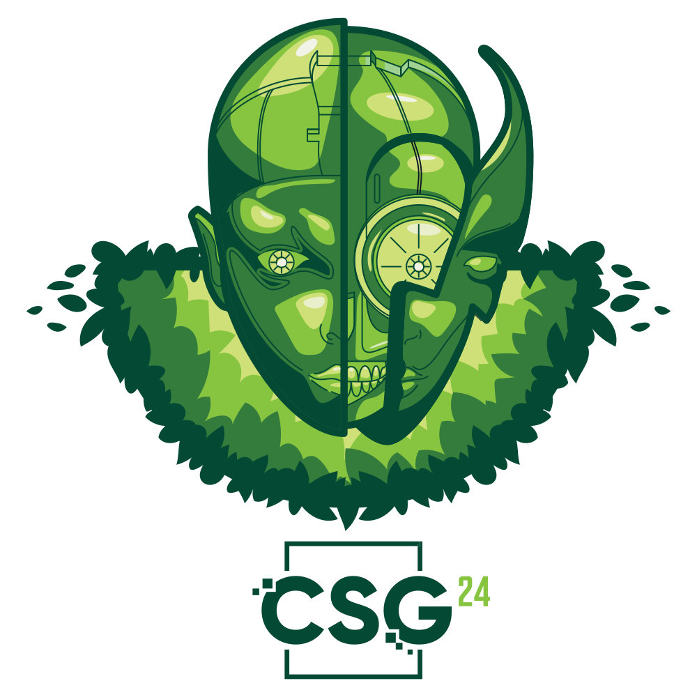

# DEVOPS - CSGames 2024

Bienvenue à la compétition de devops. Cette compétition a comme but
la mise en pratique de vos connaissances en intégration continue de systèmes modulaires.

Avant de débuter, il est primordiale d'avoir accès aux ressources suivantes :
- Votre numéro d'équipe.
- Votre nom d'utilisateur d'équipe, au format : `team{# d'équipe}@cs2024.one`
- Votre mot de passe d'équipe.

**Ces informations vous serons fournies suite à votre arrivée.**

### Règles générales

- Aucune communication (bidirectionnelle) : il est uniquement permis de communiquer avec les membres de votre équipe.
- Utilisation d'AI générative interdite (ChatGPT, Copilot, ...) : l'utilisation de ces outils sera considérés comme une communication extérieure.
- Ne pas tenter de nuire à l'infrastructure de la compétition.

> Note : Les forums d'aide en ligne (Stack overflow, Reddit, ...) ne sont pas considéré comme de l'aide extérieur. Leur utilisation est donc permise.
> Vous ne pouvez toutefois pas poser de questions sur ces forums.

En cas de non-respect de ces règles des pénalités seront appliqués : **perte de point, disqualification**.

## Introduction et objectif
Certains de vos concitoyens sont resté coincés à l'intérieur d'un bunker dans un lieu isolé et **entouré d'arbres**! Nous appellerons ce lieu "la jungle".
Votre objectif est de les aider en s'en échapper. Pour ce faire, vous devez trouver un moyen de communiquer avec eux.

Le bunker dispose d'un seul accès réseau et celui-ci permet uniquement d'accéder à un service détenu par une IA capricieuse
qui surveille toutes les requêtes. Pour s'échapper et retrouver la civilisation les habitant de la jungle doivent avoir accès aux informations suivantes :

- La météo, les plantes font moins peur quand il fait froid
- Une carte
- Le code d'accès de la porte

Vous avez la chance de disposer d'un accès complet à internet (sauf ChatGPT 🤷) et au cluster contrôlé par l'IA.
Vous pourrez ainsi aider vos concitoyens en leur fournissant les informations dont ils ont besoin!

L'architecture simplifiée peut être résumée par la figure suivante :

Les habitant de la jungle dispose d'une communication directe à l'IA qui se trouve dans le même cluster.
Votre équipe se trouve dans une autre cluster qui n'est pas limité dans ces requêtes extérieures.
Votre cluster peut communiquer avec l'IA par l'entremise d'un réseau virtuel (VNET) mis en place entre les deux clusters (cette étape est déjà réalisée pour vous).

Bien entendu, le compte Azure fournit donne uniquement accès à votre cluster (Team cluster).
En déployant votre code dans le cluster de votre équipe, vous serez en mesure d'interagir avec la jungle.

Les étapes à réaliser afin d'accomplir votre mission sont listés dans [Épreuves](#épreuves).
Le [guide de départ](#guide-de-départ) décrit la configuration requise pour compléter les épreuves.

Bonne chance!

## Guide de départ

Cette section détails installation des dépendances requises.

Bien que cette compétition puisse être réalisée sur Windows et MacOS, l'utilisation de Linux est encouragée.
Sous Windows, il est possible d'utiliser WSL.

Éditeurs recommandés : VSCode, RustRover (en beta).

### Installation des dépendances :
- Docker, engin (de préférence) ou desktop : https://docs.docker.com/engine/install/

### Dépendances recommandées :
- AZ shell, facilite l'accès au cluster : https://learn.microsoft.com/en-us/cli/azure/install-azure-cli
- Helm, permet de tester localement les charts avant de les déployer : https://helm.sh/docs/intro/install/
- Rust : https://www.rust-lang.org/tools/install
- Clippy, permet le formatage du code source : ``rustup component add clippy``

> À noter : L'utilisation de rust n'est pas obligatoire, cependant certains problèmes nécessite une puissance de calcul élevée.

## Épreuves

### 1.1 Serveur HTTP
### 1.2 Conteneur Docker

### 2. Déploiement
#### 2.1 Helm
#### 2.2 Azure
#### 2.3 Pipeline gitlab

### 3. Accéder à la jungle

### 4. Libérer les prisonniers
#### 4.1 Fournir un accès
#### 4.2 Météo
#### 4.3 Carte
#### 4.4 Code

### 5. Bonus

Où se trouve le bunker ?

> ?

## Évaluation

Les critères d'évaluation sont les suivants :

| Critères                | Score /20 |
|-------------------------|-----------|
| Code de base et Docker  | /5        |
| Déploiement             | /5        |
| Accéder à la jungle     | /2        |
| Libérer les prisonniers | /6        |
| Qualité de la solution  | /2        |

Les quatre premiers critères sont détaillées dans la section [Épreuves](#épreuves).
Le dernier critère est beaucoup plus subjectif et sera évalué en fonction de la cohérence générale de la solution.
Il ne s'agit pas proprement dit d'évaluer la qualité du code, mais plutôt du fonctionnement général. Des points seront retranché
en cas de non-respect (évident) de bonne pratique ou encore l'utilisation de hack pouvant être évités.

> À noter : L'évaluation est partiellement automatisée, néanmoins l'ensemble de votre travail sera révisé manuellement.
> En cas de doute, n'hésitez pas à indiquer vos suppositions en commentaire.

## Erreurs fréquentes
TODO ?
